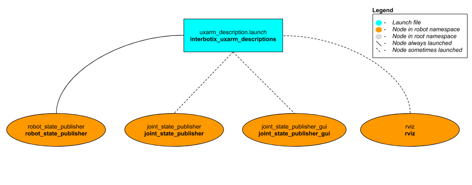

# interbotix_uxarm_descriptions

## Overview
This package contains the URDFs and meshes for all the UFactory xArms. The STL files for each robot are located in a unique folder inside the [meshes](meshes/) directory. Next, the URDFs for the robot are located in the [urdf](urdf/) directory. They are written in 'xacro' format so that users have the ability to customize what parts of the URDF get loaded to the parameter server (see the 'Usage' section below for details). Note that all the other ROS packages in the sub-repo reference this package to launch the robot description.

## Structure

This package contains the [uxarm_description.launch](launch/uxarm_description.launch) file responsible for loading parts or all of the robot model. It launches up to four nodes as described below:
- **joint_state_publisher** - responsible for parsing the 'robot_description' parameter to find all non-fixed joints and publish a JointState message with those joints defined.
- **joint_state_publisher_gui** - does the same thing as the 'joint_state_publisher' node but with a GUI that allows a user to easily manipulate the joints.
- **robot_state_publisher** - uses the URDF specified by the parameter robot_description and the joint positions from the joint_states topic to calculate the forward kinematics of the robot and publish the results via tf.
- **rviz** - displays the virtual robot model using the transforms in the 'tf' topic.

## Usage
To run this package, type the line below in a terminal. Note that the `robot_model` argument must be specified as the name of one of the URDF files located in the [urdf](/urdf) directory (excluding the '.urdf.xacro' part). For example, to launch the xArm6 arm, type:
```
$ roslaunch interbotix_uxarm_descriptions uxarm_description.launch robot_model:=uxarm6 use_joint_pub_gui:=true
```
This is the bare minimum needed to get up and running. Take a look at the table below to see how to further customize with other launch file arguments.

| Argument | Description | Default Value |
| -------- | ----------- | :-----------: |
| robot_model | model type of the Interbotix Arm such as 'uxarm5' or 'uxarm6' | "" |
| robot_name | name of the robot (typically equal to `robot_model`, but could be anything) | "$(arg robot_model)" |
| base_link_frame | name of the 'root' link on the arm; typically 'base_link', but can be changed if attaching the arm to a mobile base that already has a 'base_link' frame| 'base_link' |
| show_gripper | if true, the gripper is included in the 'robot_description' parameter; if false, the gripper is not loaded to the parameter server. Set to false if you have a custom gripper attachment or are not using a gripper | true |
| use_world_frame | set this to true if you would like to load a 'world' frame to the 'robot_description' parameter which is located exactly at the 'base_link' frame of the robot; if using multiple robots or if you would like to attach the 'base_link' frame of the robot to a different frame, set this to false | true |  
| external_urdf_loc | the file path to the custom urdf.xacro file that you would like to include in the Interbotix robot's urdf.xacro file| "" |
| use_rviz | launches Rviz | true |
| load_gazebo_configs | set this to true if Gazebo is being used; it makes sure to include Gazebo related configs in the 'robot_description' parameter such as colors and the mimic_joint_plugin for the gripper | false |
| use_joint_pub | launches the joint_state_publisher node | false |
| use_joint_pub_gui | launches the joint_state_publisher GUI | false |
| rate | rate at which the joint_state_publisher should publish messages | 10 |
| source_list | various joint state topics to feed into the joint_state_publisher node | "[]" |
| rvizconfig | file path to the config file Rviz should load | refer to [uxarm_description.launch](launch/uxarm_description.launch) |
| model | file path to the robot-specific URDF including arguments to be passed in | refer to [uxarm_description.launch](launch/uxarm_description.launch) |
